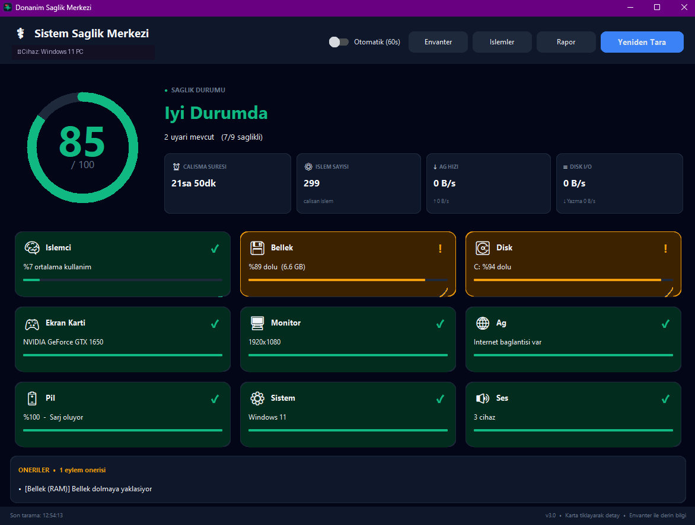

# Sistem Sağlık Merkezi v3.0

Windows için tek dosya, kurulumsuz **donanım & sistem sağlık tarayıcısı**. Bilgisayarınızın 9 farklı bileşenini (CPU, RAM, Disk, Ekran Kartı, Monitör, Ağ, Pil, Sistem, Ses) tek tek inceleyip toplam bir **0-100 sağlık skoru** üretir, akıllı uyarılar verir.

## Görsel

## Özellikler

- **0–100 sağlık skoru** — her bileşene puan veren akıllı algoritma
- **9 bileşen kartı** — İşlemci, Bellek, Disk, Ekran Kartı, Monitör, Ağ, Pil, Sistem, Ses
- **Akıllı öneriler** — "RAM dolmaya yaklaşıyor" gibi sorun tespit + tavsiye
- **Anlık metrikler** — Çalışma süresi, işlem sayısı, ağ hızı, disk I/O (read/write)
- **4 ana eylem:**
  - **Otomatik tarama** (60s) — sürekli izleme
  - **Envanter** — donanım envanterini çıkar
  - **İşlemler** — çalışan process'leri incele
  - **Rapor** — detaylı sağlık raporu
- **Karta tıklayarak detay** — her bileşenin derin bilgisi
- **Tek dosya, kurulumsuz** — sadece çift tıkla, çalış
- **WMI tabanlı** — Windows'un native donanım API'lerini kullanır
- **Skor renk kodlaması** — yeşil (sağlıklı) / turuncu (uyarı) / kırmızı (kritik)

## Kurulum

Yok. Sadece:

1. [Releases](https://github.com/ctrismail/sistem-saglik-merkezi/releases) sayfasından `Sistem-Saglik-Merkezi.exe` indir.
2. Çift tıkla.

Windows SmartScreen uyarısı çıkarsa: **Daha fazla bilgi → Yine de çalıştır**. Uygulama imzasız (sertifika maliyeti) ama açık kaynaktır.

## Sistem Gereksinimleri

- Windows 10 / 11 (x64)
- ~7 MB RAM
- Yönetici izni gerekmez (donanım okuma için sadece WMI)

## Teknik

- **Dil:** Python 3.13
- **GUI Framework:** modern dark dashboard (yeşil/turuncu/kırmızı sağlık renkleri)
- **Sistem erişimi:** WMI (Windows Management Instrumentation) + pywin32
- **Paketleme:** PyInstaller (tek `.exe`)
- **Boyut:** ~16 MB

## Sürüm Notları

### v3.0 (mevcut)
- 9 bileşen kartı (önceki: 8) — **Ses cihazları** eklendi
- **Disk I/O** anlık metrik (read/write byte/s)
- **İşlemler** ve **Rapor** tab'ları eklendi
- **Akıllı öneriler** sistemi — sorun tespit + tavsiye
- Skor renk kodlaması (yeşil/turuncu/kırmızı)
- Kart tıklayarak detay görüntüleme

## Geliştirici

İsmail Hakkı ÇITIR — Bilgisayar Mühendisi
🌐 [ctrbilisim.com.tr](https://ctrbilisim.com.tr) · [GitHub](https://github.com/ctrismail) · [LinkedIn](https://linkedin.com/in/ctrismail)

## Lisans

MIT — bkz. [LICENSE](LICENSE)
